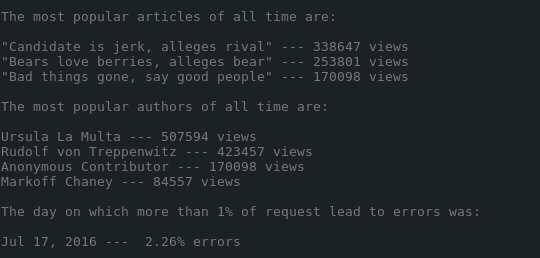

# Logs Analysis Project
## What are we analyzing?
> The program has to answer the following questions by accessing the database news,
and display information as a sorted list:

##### 1. What are the most popular three articles of all time? Which articles have been accessed the most?
###### Example:

> "Princess Shellfish Marries Prince Handsome" — 1201 views

> "Baltimore Ravens Defeat Rhode Island Shoggoths" — 915 views

> "Political Scandal Ends In Political Scandal" — 553 views

##### 2\. Who are the most popular article authors of all time? That is, when you sum up all of the articles each author has written, which authors get the most page views? 
###### Example:

> Ursula La Multa — 2304 views

> Rudolf von Treppenwitz — 1985 views

> Markoff Chaney — 1723 views

> Anonymous Contributor — 1023 views

##### 3\. On which days did more than 1% of requests lead to errors? 

###### 	Example:

> July 29, 2016 — 2.5% errors

# What we get?
> This is how the output looks.

###### 1\. The most popular articles of all time are:

"Candidate is jerk, alleges rival" --- 338647 views

"Bears love berries, alleges bear" --- 253801 views

"Bad things gone, say good people" --- 170098 views

###### 2\. The most popular authors of all time are:

Ursula La Multa --- 507594 views
Rudolf von Treppenwitz --- 423457 views
Anonymous Contributor --- 170098 views
Markoff Chaney --- 84557 views

###### 3\. The day on which more than 1% of request lead to errors was:

Jul 17, 2016 ---  2.26% errors

## How we get it?
### Commands to:

#### Create views:

    python create_views.py

> This will create the following views in the news database:
pop\_articles, popular\_authors, errors

#### Get the report:

    python report.py

> This will return a report from the database in plain text as a sorted list.

### Alternatively you can execute each individual view inside the news database from your terminal:

To enter the news database first execute:

    psql

and then connect to the news database with:

    \c news

> ##### Note: If you haven't already created the views, execute the following command first:
    python create_views.py 

#### Once you have entered the news database you can execute each view by simply typing:

    SELECT * FROM view_name. 
#### Example: 
    SELECT * FROM popular_authors

